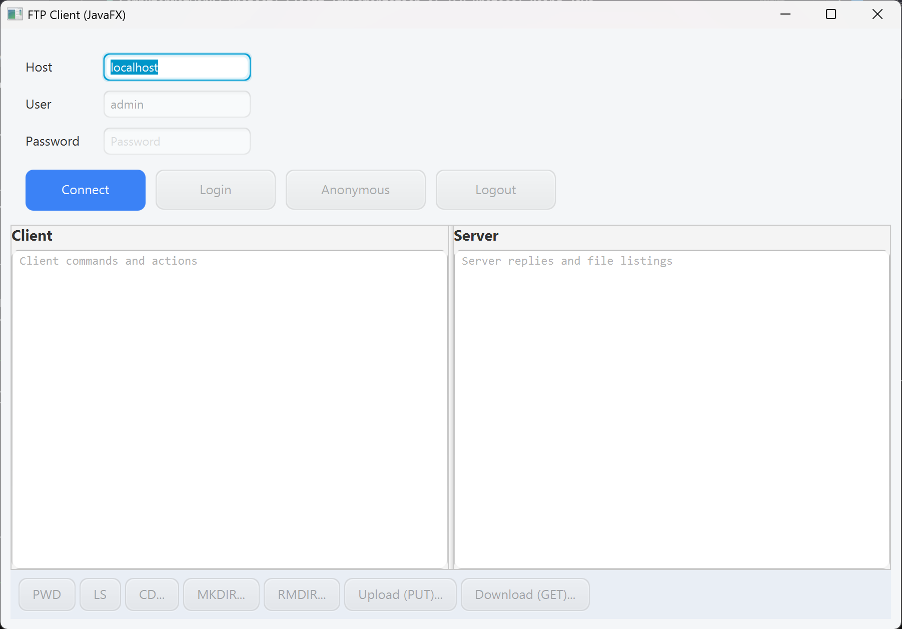
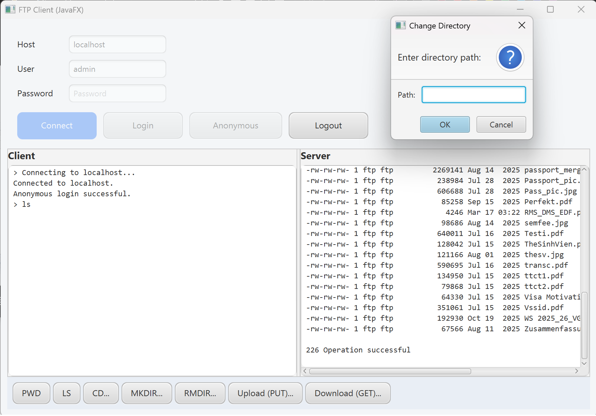

# ComputerNetwork2 Project: Client Implementation of TCP Protocol using Java

## Overview
This project is a custom FTP (File Transfer Protocol) Client built from scratch using Java as part of the Computer Network 2 final project. It demonstrates a working implementation of application-layer protocols over TCP sockets, interacting directly with FTP servers through raw commands and handling active control socket and passive data socket transfers for file management.

## Pre-requirement
To build and run this application, you will need:
- **Java Development Kit (JDK):** Version 17 or higher (with JavaFX support)
- **Maven:** For dependency management and building the project
- An active internet connection or a locally hosted FTP server for testing (in this case FileZilla).

## Technology Used (Libraries)
- **java.net & java.io:** for TCP `Socket` programming, `InputStream`/`OutputStream` management, and standard I/O manipulation for protocol data transmission.
- **JavaFX:** Providing the graphical user interface (GUI), dialogs, and platform-threading (`Platform.runLater`) for non-blocking UI updates.
- **Maven:** Project builder/ management.

## UI Visuals


### Connection/Login Screen

*Description: The login interface allowing serverconnection, user authentication or Anonymous login configurations.*

### Main Dashboard & File Operations

*Description: The central hub where users can see server logs, client command history, and execute various FTP procedures using the command toolbar.*

## How to Run the APP

### Using Maven (Command Line)
1. Open your terminal and navigate to the project's root directory (where `pom.xml` is located):
   ```bash
   cd /path/to/CompNet2-FTPClient
   ```
2. Clean and compile the project:
   ```bash
   mvn clean compile
   ```
3. Run the application:
   *(Assuming the JavaFX maven plugin or configured)*
   ```bash
   mvn javafx:run
   # OR
   mvn exec:java -Dexec.mainClass="herrcult69.compnet.AppFTP"
   ```

## Configuration & Resources
This application uses external (via CSS) UI styling and server configurations using the `src/main/resources/` directory:
- **`style.css`**: Contains all JavaFX styling rules for the UI.
- **`config.properties`**: Manages known server profiles. You can easily edit this file to add or modify anonymous login credentials for specific server IPs. The application reads these mappings, allowing you to add login profiles without modifying backend Java code.

## Features
- **Authentication:** Standard User/Password login as well as Anonymous profile logging.
- **Passive Mode (PASV):** Seamless data connection brokering for data integrity across firewalls.
- **Directory Navigation:** 
  - Print Working Directory (`PWD`)
  - Change Directory (`CWD`)
  - List contents (`LIST`)
- **Directory Management:** 
  - Make Directory (`MKD`)
  - Remove Directory (`RMD`)
- **File Transfer (Binary/Image Mode `TYPE I`):** 
  - Upload files to the server (`STOR`)
  - Download files from the server (`RETR`)
  - Delete files from the server (`DELE`)
- **Live Logging:** Real-time dual-console output showing both Client Commands and Raw Server Responses.

## Developer
- **Name:** herrcult69 (Huynh Van Hoa Le)
- **GitHub:** [CompNet2-FTPClient](https://github.com/herrcult69/CompNet2-FTPClient)

## Integrity Declaration
I confirm that this submission is my own work. I did not copy code from AI tools, classmates, or online repositories.